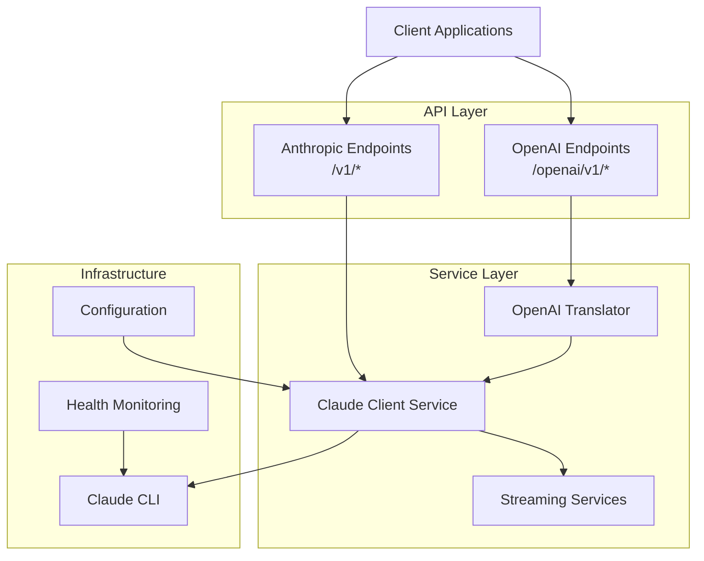

# Claude Code Proxy API

A personal API server that provides both Anthropic and OpenAI-compatible interfaces for Claude AI models. This proxy enables you to use your existing Claude subscription locally through familiar API endpoints, making it easy to integrate Claude into your personal projects and tools.

## Overview

The Claude Code Proxy API Server acts as a local bridge between your applications and Claude AI models, providing:

- **Dual API Compatibility**: Full support for both Anthropic and OpenAI API formats
- **Streaming Support**: Real-time response streaming for both API formats  
- **Request Translation**: Seamless format conversion between OpenAI and Anthropic formats
- **OAuth2 Authentication**: Uses your existing Claude subscription through secure OAuth2 authentication
- **Local Execution**: Runs entirely on your computer with no external data sharing
- **Docker Isolation**: Secure containerized execution for Claude Code operations

## Quick Start

### Installation

```bash
# Clone the repository
git clone https://github.com/CaddyGlow/claude-code-proxy-api.git
cd claude-code-proxy-api

# Install dependencies
uv sync

# Run the server
uv run python main.py
```

The server will start on `http://localhost:8000` by default.

### Basic Usage

#### Anthropic Format
```bash
curl -X POST http://localhost:8000/v1/chat/completions \
  -H "Content-Type: application/json" \
  -d '{
    "model": "claude-3-5-sonnet-20241022",
    "messages": [{"role": "user", "content": "Hello!"}],
    "max_tokens": 100
  }'
```

#### OpenAI Format
```bash
curl -X POST http://localhost:8000/openai/v1/chat/completions \
  -H "Content-Type: application/json" \
  -d '{
    "model": "claude-3-5-sonnet-20241022",
    "messages": [{"role": "user", "content": "Hello!"}],
    "max_tokens": 100
  }'
```

## Key Features

### Personal Use Benefits
- **Your Claude Subscription**: Use your existing Claude subscription without additional API costs
- **Local Privacy**: All processing happens on your computer - no data leaves your machine
- **Dual API Compatibility**: Full support for both Anthropic and OpenAI API formats
- **Streaming Support**: Real-time response streaming for both API formats
- **Request Translation**: Seamless format conversion between OpenAI and Anthropic formats
- **OAuth2 Authentication**: Secure authentication using your Claude account credentials

### Security & Isolation Features
- **Docker Isolation**: Secure containerized execution for Claude Code operations
- **Local Execution**: No external data sharing or third-party services
- **Auto-detection**: Smart Claude CLI path resolution and configuration
- **Health Monitoring**: Built-in health checks and status endpoints
- **Error Handling**: Comprehensive error handling with detailed error responses
- **CORS Support**: Cross-origin request handling for local web applications

## Architecture

The application follows a layered architecture with clear separation of concerns:



## Documentation Structure

This documentation is organized into several sections:

- **[Getting Started](getting-started/quickstart.md)**: Installation, configuration, and first steps
- **[Configuration](getting-started/configuration.md)**: Personal setup and customization options
- **[API Reference](api-reference/overview.md)**: Complete API endpoint documentation
- **[Examples](examples/python-client.md)**: Practical usage examples in different languages
- **[Architecture](architecture.md)**: System design and component overview
- **[Docker Setup](deployment.md)**: Containerized deployment for security and isolation

## Community and Support

- **Issues**: [GitHub Issues](https://github.com/CaddyGlow/claude-code-proxy-api/issues)
- **Source Code**: [GitHub Repository](https://github.com/CaddyGlow/claude-code-proxy-api)
- **Documentation**: [Project Documentation](https://CaddyGlow.github.io/claude-code-proxy-api)

## License

This project is licensed under the MIT License - see the [LICENSE](https://github.com/CaddyGlow/claude-code-proxy-api/blob/main/LICENSE) file for details.