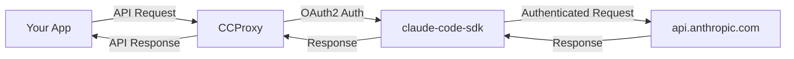

# Claude Code Proxy API (CCProxy)

A local reverse proxy server that routes requests to api.anthropic.com/v1/messages, leveraging your existing Claude subscription without requiring separate API costs.

## What is CCProxy?

CCProxy is a lightweight server that runs on your computer and acts as a bridge between your applications and Claude AI. It uses the official claude-code-sdk to authenticate with your Claude account, allowing you to:

- **Use your Claude Pro/Team/Enterprise subscription** instead of paying for API access
- **Access Claude through standard API interfaces** (both Anthropic and OpenAI formats)
- **Run everything locally** with no external dependencies

## Key Features

### 🔐 Subscription-Based Access
- Uses OAuth2 authentication with your existing Claude account
- No API keys required - just login with your Claude credentials
- Automatic token management and renewal

### 🔄 Two Access Modes

#### Claude Code Mode (Default at `/`)
- Processes requests through claude-code-sdk
- Provides access to all Claude Code tools and features
- Some limitations: no direct ToolCall support, limited model settings

#### API Mode (at `/api/`)
- Direct reverse proxy to api.anthropic.com
- Full API feature access including ToolCall
- Complete control over all model settings
- Only adds necessary authentication headers

### 🌐 Universal Compatibility
- **Anthropic API format** at `/v1/messages`
- **OpenAI API format** at `/openai/v1/chat/completions`
- Drop-in replacement for existing applications
- Streaming support for real-time responses

## Quick Start

### 1. Install CCProxy

```bash
# Using pipx (recommended)
pipx install git+https://github.com/CaddyGlow/claude-code-proxy-api.git

# Or from source for development
git clone https://github.com/CaddyGlow/claude-code-proxy-api.git
cd claude-code-proxy-api
uv sync
```

### 2. Authenticate with Claude

```bash
# Login to your Claude account
ccproxy auth login

# Verify authentication
ccproxy auth validate
```

### 3. Start the Server

```bash
# Start the proxy server
ccproxy

# Or with custom settings
ccproxy --port 8080 --log-level DEBUG
```

### 4. Use with Your Applications

```python
# Example with Python
from anthropic import Anthropic

# Claude Code mode (default) - with all tools
client = Anthropic(
    base_url="http://localhost:8000",
    api_key="dummy"  # Not used but required by SDK
)

# API mode - direct proxy for full control
client = Anthropic(
    base_url="http://localhost:8000/api",
    api_key="dummy"
)

response = client.messages.create(
    model="claude-3-5-sonnet-20241022",
    messages=[{"role": "user", "content": "Hello!"}],
    max_tokens=100
)
```

## Why CCProxy?

### 💰 Cost Savings
- Use your existing Claude Pro/Team subscription
- No separate API costs
- Same powerful Claude models

### 🔒 Privacy & Security
- Runs entirely on your local machine
- Your data never leaves your computer
- Credentials stored securely locally

### 🛠️ Developer Friendly
- Compatible with existing Anthropic and OpenAI SDKs
- No code changes needed in your applications
- Just point to `localhost:8000`

## Supported Models

All models available to your Claude subscription:

| Model | Description |
|-------|-------------|
| `claude-opus-4-20250514` | Claude 4 Opus (most capable) |
| `claude-sonnet-4-20250514` | Claude 4 Sonnet (latest) |
| `claude-3-7-sonnet-20250219` | Claude 3.7 Sonnet |
| `claude-3-5-sonnet-20241022` | Claude 3.5 Sonnet |

## How It Works



1. Your application sends standard API requests to CCProxy
2. CCProxy uses your Claude credentials via claude-code-sdk
3. Requests are forwarded to api.anthropic.com with proper authentication
4. Responses are returned to your application

## Authentication

### Initial Setup
```bash
# One-time authentication
ccproxy auth login
```

### Managing Credentials
```bash
# Check status
ccproxy auth validate

# View details (auto-renews if expired)
ccproxy auth info
```

## Next Steps

- **[Quick Start Guide](getting-started/quickstart.md)** - Get up and running in minutes
- **[Installation Options](getting-started/installation.md)** - Detailed installation instructions
- **[API Usage](user-guide/api-usage.md)** - Learn about the two proxy modes
- **[Examples](examples.md)** - See code examples for various use cases

## Need Help?

- **[Troubleshooting](getting-started/quickstart.md#troubleshooting)** - Common issues and solutions
- **[GitHub Issues](https://github.com/CaddyGlow/claude-code-proxy-api/issues)** - Report bugs or request features
- **[API Reference](api-reference.md)** - Complete endpoint documentation

## License

This project is licensed under the MIT License. CCProxy is not affiliated with Anthropic. It's a community tool that helps you use your existing Claude subscription more effectively.
