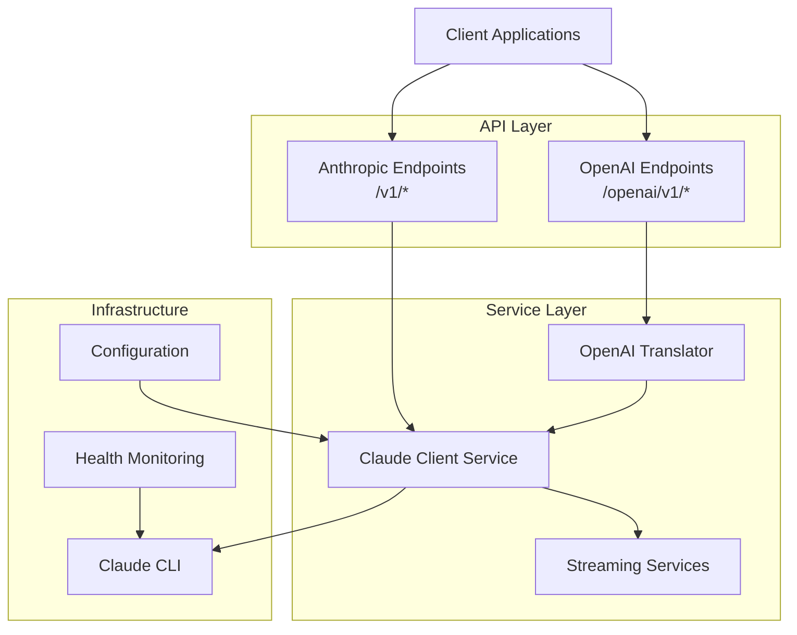

# Claude Code Proxy API

A high-performance API server that provides both Anthropic and OpenAI-compatible interfaces for Claude AI models. This proxy enables you to use your Claude OAuth account or API access through familiar API endpoints, making it easy to integrate Claude into existing applications.

## Overview

The Claude Code Proxy API Server acts as a bridge between your applications and Claude AI models, providing:

- **Dual API Compatibility**: Full support for both Anthropic and OpenAI API formats
- **Streaming Support**: Real-time response streaming for both API formats  
- **Request Translation**: Seamless format conversion between OpenAI and Anthropic formats
- **Claude CLI Integration**: Uses the official Claude Code Python SDK for authentication
- **Production Ready**: Docker support, health monitoring, error handling, and rate limiting

## Quick Start

### Installation

```bash
# Clone the repository
git clone https://github.com/your-username/claude-proxy.git
cd claude-proxy

# Install dependencies
uv sync

# Run the server
uv run python main.py
```

The server will start on `http://localhost:8000` by default.

### Basic Usage

#### Anthropic Format
```bash
curl -X POST http://localhost:8000/v1/chat/completions \
  -H "Content-Type: application/json" \
  -d '{
    "model": "claude-3-5-sonnet-20241022",
    "messages": [{"role": "user", "content": "Hello!"}],
    "max_tokens": 100
  }'
```

#### OpenAI Format
```bash
curl -X POST http://localhost:8000/openai/v1/chat/completions \
  -H "Content-Type: application/json" \
  -d '{
    "model": "claude-3-5-sonnet-20241022",
    "messages": [{"role": "user", "content": "Hello!"}],
    "max_tokens": 100
  }'
```

## Key Features

### Core Capabilities
- **Dual API Compatibility**: Full support for both Anthropic and OpenAI API formats
- **Streaming Support**: Real-time response streaming for both API formats
- **Request Translation**: Seamless format conversion between OpenAI and Anthropic formats
- **Claude CLI Integration**: Uses the official Claude Code Python SDK for authentication
- **Auto-detection**: Smart Claude CLI path resolution and configuration

### Production Features
- **Docker Support**: Production-ready containerization with multi-stage builds
- **Health Monitoring**: Built-in health checks and metrics endpoints
- **Error Handling**: Comprehensive error handling with detailed error responses
- **Rate Limiting**: Built-in protection against API abuse
- **CORS Support**: Cross-origin request handling for web applications
- **Structured Logging**: JSON-formatted logs for monitoring and debugging

## Architecture

The application follows a layered architecture with clear separation of concerns:



## Documentation Structure

This documentation is organized into several sections:

- **[Getting Started](getting-started/quickstart.md)**: Installation, configuration, and first steps
- **[User Guide](user-guide/api-usage.md)**: Detailed usage instructions and examples
- **[API Reference](api-reference/overview.md)**: Complete API endpoint documentation
- **[Developer Guide](developer-guide/architecture.md)**: Architecture, development setup, and contribution guidelines
- **[Deployment](deployment/docker.md)**: Production deployment guides and best practices
- **[Code Reference](reference/)**: Auto-generated API documentation from source code
- **[Examples](examples/python-client.md)**: Practical usage examples in different languages

## Community and Support

- **Issues**: [GitHub Issues](https://github.com/your-username/claude-proxy/issues)
- **Source Code**: [GitHub Repository](https://github.com/your-username/claude-proxy)
- **Documentation**: [Project Documentation](https://your-username.github.io/claude-proxy)

## License

This project is licensed under the MIT License - see the [LICENSE](https://github.com/your-username/claude-proxy/blob/main/LICENSE) file for details.